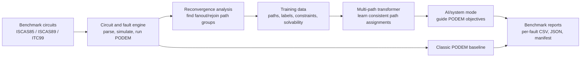
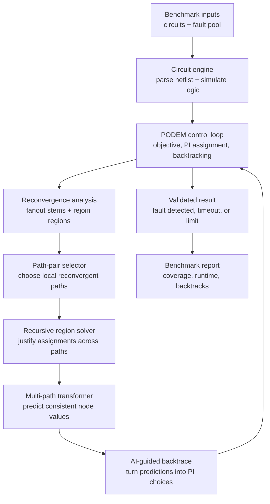
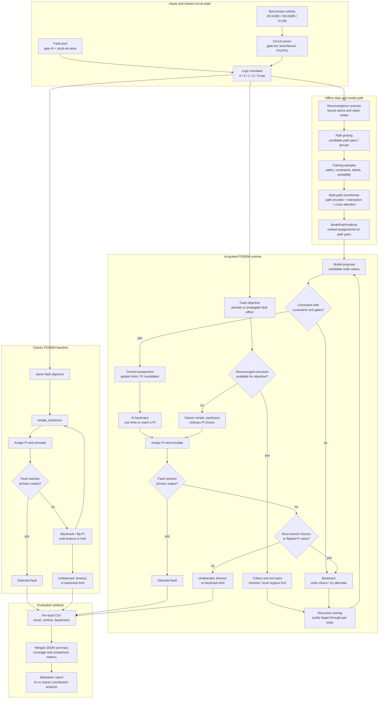
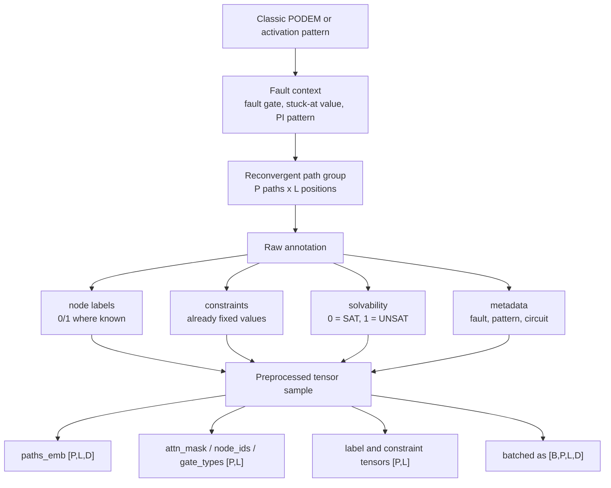
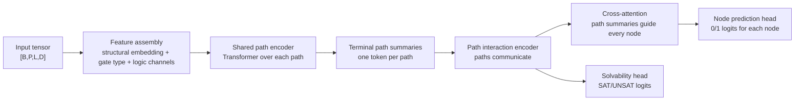
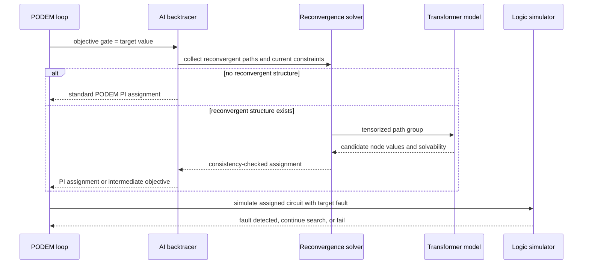

# S-Imply Architecture Summary

## Executive Overview

S-Imply is a research system for improving automatic test pattern generation
(ATPG), which is the process of finding circuit input patterns that expose
hardware faults. The project focuses on a specific source of difficulty in ATPG:
reconvergent fanout. This happens when a circuit signal splits into multiple
branches and later joins again. A decision that seems valid on one branch can be
invalid once the branches meet, so ordinary search can waste time exploring
assignments that are locally plausible but globally inconsistent.

The system is deliberately hybrid. It does not replace ATPG with a black-box
neural network. Classic PODEM remains responsible for fault activation,
propagation, simulation, and final correctness. The AI model is used as a guide
inside the search, especially around reconvergent regions where the choice of
internal logic values matters most. This gives the system a practical safety
property: a detected fault still has to be validated by the circuit simulator and
the PODEM flow, not merely asserted by the model.

At a high level, S-Imply has four connected subsystems:

1. A circuit and fault engine that parses benchmark circuits, represents
   three-valued logic, simulates faults, and runs classic PODEM.
2. A reconvergence analysis layer that identifies difficult fanout/rejoin
   regions and converts them into path groups.
3. A transformer-based model that predicts likely consistent logic assignments
   over those path groups.
4. A training and benchmarking pipeline that keeps training circuits separate
   from held-out test circuits and records auditable per-fault results.

The end-to-end runtime flow has two solver paths. Classic PODEM is the
reference path. AI-guided PODEM keeps the same objective, simulation, and
backtracking loop, but replaces selected backtrace choices with reconvergent
path-pair predictions when a relevant reconvergent region exists.

For presentations, the same system can be reduced to a slide-level block
diagram:

The current success target is 80% AI/system-mode coverage over the faults that
classic PODEM can cover. For example, if classic PODEM detects 7,000 faults in a
10,000-fault benchmark, AI/system mode must detect 5,600 faults. Faults without
reconvergent structure are handled through the standard PODEM path inside AI
mode; this is part of the intended solver design, not fallback.

## Problem Being Solved

ATPG is a search problem. Given a target fault, such as a stuck-at-0 or
stuck-at-1 fault on a gate, the solver must find primary input values that make
the fault visible at a primary output. PODEM does this by repeatedly selecting an
objective, backtracing that objective to a primary input, assigning a value, and
simulating the circuit to see whether the fault effect has moved closer to an
output.

The hard cases arise when the same upstream signal affects a later gate through
several paths. These paths are not independent. A branch assignment can satisfy
one path but block the other, or it can make the reconvergent gate impossible to
justify. Classic PODEM can recover by backtracking, but backtracking is exactly
where runtime grows. S-Imply is built around the idea that these reconvergent
structures have learnable patterns. If the model can predict a good internal
assignment, PODEM can spend less time wandering through poor choices.

## Circuit, Logic, and Fault Engine

The base ATPG layer parses `.bench` circuits into an internal gate list. Gates
carry fanin and fanout relationships, gate type, and current logic value. The
logic system uses more than binary 0 and 1. It also tracks unknown values and
fault-effect values such as D and D-bar, which are needed to distinguish the
fault-free circuit from the faulty circuit during simulation.

Classic PODEM is the reference solver. Its responsibilities are:

- choose objectives for fault activation and propagation;
- backtrace objectives toward primary inputs;
- assign primary input values;
- run logic simulation after each assignment;
- identify whether the fault effect reaches a primary output;
- count search effort, including recursive calls and backtracks.

Because this layer is the correctness authority, both classic and AI-guided
runs are ultimately measured by detected faults, timing, and simulator-verified
outcomes.

## Reconvergence Analysis

The AI model does not look at the entire circuit at once. Instead, S-Imply first
finds reconvergent path groups. A path group starts at a shared source or fanout
stem, follows two or more branches, and ends at a reconvergent gate. These path
groups are the local structures where consistency is most important.

The reconvergence solver identifies candidate path pairs, orders them, and uses
regional consistency checks to avoid accepting assignments that only work inside
one isolated path. The project also caches reconvergent topology per circuit.
This is important because reconvergent path structure depends only on the netlist,
not on the current fault or model checkpoint. Once cached, the same structure can
be reused during data generation, inference, and benchmarking.

This layer is also where the system decides whether AI is relevant for a
specific objective. If a fault or objective has no reconvergent pair, the system
does not force a neural prediction. It uses the normal PODEM path. That behavior
is not a fallback from failed AI; it is the intended handling for a simple region
where there is no reconvergent structure for the model to reason about.

## Dataset Strategy

The training data is generated from benchmark circuits, not from hand-written
examples. The current strategy is to train and validate on ISCAS85 and ISCAS89
circuits while keeping ITC99 held out for testing. This split matters because the
project goal is not only to fit known circuits, but to show that the learned
guidance transfers to larger or different benchmark families.

The dataset builder runs ATPG and simulation workflows over the training
circuits to produce fault-driven samples. Each sample records a reconvergent path
group, structural embeddings for the gates, gate types, node IDs, masks for
variable-length paths, and labels or constraints that describe valid logic
assignments. The data can include both solvable and unsolvable examples so the
model learns when a requested reconvergent assignment is not feasible.

Because the raw sample count can grow quickly, the pipeline supports chunked
generation and preprocessed tensor shards. The shard format makes training more
practical: instead of repeatedly loading and converting large Python objects, the
trainer can stream tensors from disk and batch samples that live in the same
shard. The training wrapper also has disk and RAM checks so long experiments fail
early rather than corrupting a run after hours of work.

The held-out test set is ITC99, especially `b17.bench`. The 10% gate subset is
selected deterministically and contains 6,445 faults out of 64,458 total b17
faults. Full b17 runs can also be executed, but the 10% gate is used as the
promotion checkpoint before claiming broader results.

## Training Data Format and Annotation

Each training example represents one reconvergent path group under a particular
fault context. Conceptually, it says: "given this fault objective and these
already-known circuit values, here are the path nodes that matter and the logic
values that make the region consistent." The raw generator can write a single
pickle file for small runs, but directory/chunk output is preferred for large
runs because sample count scales with:

`faults x patterns per fault x reconvergent path pairs`

The dataset builder has several important controls:

- `--bench_dirs`: training circuit sources, normally ISCAS85 and ISCAS89.
- `--max_faults`: optional cap per circuit; `0` means all faults.
- `--patterns-per-fault`: maximum detecting or activating PI patterns recorded
  for each fault; usually kept small because it multiplies dataset size.
- `--pattern-source`: `detecting` uses classic PODEM patterns as the teacher
  when possible, while `activation` uses random activation-only patterns.
- `--classic-timeout` and `--classic-max-backtracks`: limits used while
  obtaining classic PODEM teacher patterns.
- `--unsat-ratio`: probability of adding a nearby UNSAT sample by corrupting a
  visible constraint. This teaches the solvability head that some requests are
  impossible, not merely hard.
- `--max-samples-per-circuit`: hard cap for storage control.

The raw annotation stored for each sample includes the circuit file, the fault
gate and fault value, the selected primary-input pattern or pattern ID, the
reconvergent paths, node-level labels, constraints, and solvability. Solvability
uses the convention `0 = SAT` and `1 = UNSAT`. SAT samples contain labels for
nodes whose values are known from a consistent assignment. UNSAT samples are
created by flipping a visible constraint so the model sees examples where no
assignment should satisfy the requested conditions.

After preprocessing, each sample becomes tensors with these shapes:

- `paths_emb`: `[P, L, D]`, the node features for `P` paths padded or truncated
  to length `L`. `D` is the feature width. The common base embedding width is
  128, with optional final logic-value channels for known `0`, known `1`, and
  unknown.
- `attn_mask`: `[P, L]`, true for real path positions and false for padding.
- `node_ids`: `[P, L]`, the original circuit gate IDs. This lets the loss
  identify shared nodes across paths and lets debugging map model outputs back
  to the circuit.
- `gate_types`: `[P, L]`, integer gate-type IDs for AND, OR, NAND, NOR, NOT,
  buffer, primary input, and related netlist types.
- `label_mask` and `label_vals`: `[P, L]`, indicating which positions have
  supervised 0/1 labels and what those labels are.
- `constraint_mask` and `constraint_vals`: `[P, L]`, indicating known values
  that are already fixed by the current fault context or by earlier path-pair
  decisions.
- `anchor_p`, `anchor_l`, and `anchor_v`: one optional anchor hint per sample,
  represented as path index, path position, and 0/1 value.
- `solvability`: scalar class label, `0` for SAT and `1` for UNSAT.

At batching time, the collate function pads examples to:

`B x P x L x D`

where `B` is batch size. It also pads `P` and `L` to the largest sample in the
batch, optionally truncates the number of paths with `--max-paths`, and pads the
feature dimension so it is compatible with the transformer's attention heads.
Processed shard mode stores these tensors directly in `shard_*.pt` files and
uses shard-aware batching so a batch can be built with one tensor slice instead
of thousands of small Python object copies.

## Model Architecture

The model is a multi-path transformer. Its input is not a single flat circuit.
It receives a batch of reconvergent path groups shaped like:

`batch x paths x path_length x features`

Each gate along each path has structural features, a gate-type embedding, and
optionally logic-value channels. The structural features come from circuit
embedding extraction, which gives the model information about where a gate sits
in the larger topology. The gate-type embedding tells the model whether a node
is an AND, OR, NAND, NOR, NOT, buffer, or another supported gate type. Positional
encoding tells the transformer where the node appears along the path.

The model has three major stages.

First, a shared path encoder processes each path independently. This teaches the
model local path behavior, such as how an inversion chain changes a value or how
controlling values propagate through simple gates.

Second, a path interaction encoder lets the paths communicate. Each path is
summarized at its terminal reconvergent node, and those summaries are processed
together. This is the key architectural idea: the model is not only predicting
values along one branch, it is comparing branches that must agree at the
reconvergence point.

Third, a cross-attention block feeds the interaction-aware path summaries back
to every node representation. The final prediction head outputs logits for logic
0 or logic 1 at each node. A separate solvability head predicts whether the whole
reconvergent assignment is feasible.

This architecture matches the problem shape. Reconvergent ATPG failures are not
usually caused by a lack of local gate knowledge. They are caused by local
choices being inconsistent across related branches. The path-interaction and
cross-attention stages are designed to expose those branch relationships to the
model.

## Training Strategy

Training uses supervised and consistency-based signals. The model learns from
node labels when valid assignments are known, but it is also penalized for
violating Boolean behavior. This is important because a model can have high
label accuracy while still producing assignments that are impossible for a real
circuit. The loss terms therefore include:

- supervised node prediction for known values;
- solvability prediction for SAT versus UNSAT path groups;
- local gate consistency losses;
- full-path logic consistency losses;
- shared-node consistency losses when the same circuit node appears on multiple
  paths;
- reconvergence consistency losses so branches agree where they rejoin.

The trainer also shuffles path order during training. This prevents the model
from learning accidental ordering patterns, such as assuming the first path in a
sample is always special. Instead, it must learn the relationship among the
paths.

For larger runs, training supports mixed precision, gradient accumulation,
checkpointing, lazy shard loading, shard-aware batching, multi-worker data
loading, and CUDA out-of-memory retry behavior. These features are not the
research contribution by themselves, but they make the experiments repeatable on
large generated datasets.

The default training command exposes the main research and scaling parameters.
The most important model-capacity parameters are:

- `--model-dim`: internal transformer width, default 512.
- `--nhead`: attention heads, default 4.
- `--enc-layers`: shared path encoder depth, default 3.
- `--int-layers`: path interaction encoder depth, default 3.
- `--ffn-dim`: feedforward dimension inside transformer layers, default 512.
- `--max-paths`: maximum paths retained per sample, default 200 in the trainer
  and often set higher for larger experiments when memory permits.
- `--max-len`: optional curriculum filter for maximum path length.

The main optimization parameters are:

- `--epochs`: number of passes over the training set, default 10.
- `--batch-size`: number of path-group samples per batch, default 128, often
  increased substantially when using processed shards and enough GPU memory.
- `--lr`: learning rate in the internal config, default `1e-4`.
- `--amp`: enables automatic mixed precision.
- `--grad-accum`: accumulates gradients across multiple batches before an
  optimizer step.
- `--checkpointing`: trades extra compute for lower activation memory.
- `--num-workers` and `--pin-memory`: DataLoader throughput controls.
- `--shard-cache-size`: number of processed shards cached per worker.

The loss weights decide what the model is being asked to prioritize:

- `--lambda-supervised-node`: weight for supervised node labels, default 2.0.
- `--lambda-solvability`: weight for SAT/UNSAT classification, default 1.0.
- `--lambda-shared-node`: weight for making repeated circuit nodes agree across
  paths, default 1.0.
- `--lambda-logic`: weight for reconvergence-level logic consistency.
- `--lambda-full-logic`: weight for full path gate consistency.
- `--soft-edge-lambda`: weight for local soft edge consistency, default 1.0.
- `--entropy-beta`: entropy regularization for sampled logic actions.
- `--gumbel-temp` and `--gumbel-anneal-rate`: control the Gumbel-Softmax
  relaxation used when turning logits into differentiable 0/1 choices.

During a training step, the loader returns `paths_emb`, masks, node IDs, gate
types, labels, constraints, anchors, and solvability labels. The trainer moves
them to the selected device, shuffles the path dimension while keeping all
aligned tensors in sync, injects constraint and anchor values into the
logic-value feature channels, runs the transformer, and computes the composite
loss. Metrics such as edge accuracy, valid-rate, reward, constraint violation
rate, and solvability accuracy are logged so failures can be diagnosed as data
problems, logic-consistency problems, or model-capacity problems.

Validation uses the same tensor interface but disables training updates. The
important point is that validation checks whether the model's predicted logic is
compatible with circuit structure; it is not only a generic classification
score. Final claims are still made through ATPG benchmarks, because a good model
loss does not automatically mean a fault is detected by PODEM.

## How AI Plugs Into PODEM

The most important integration point is the PODEM backtrace step. In classic
PODEM, when the solver has an objective such as "make gate 3853 equal 1", it
uses a deterministic heuristic to walk backward through the circuit until it
chooses a primary input assignment. S-Imply replaces or assists that backtrace
function with an AI-aware backtracer.

The AI path works as follows:

1. PODEM selects an objective during normal fault activation or propagation.
2. The AI backtracer checks whether that objective has reconvergent path
   structure.
3. If there is no reconvergent structure, the system uses the standard PODEM
   path.
4. If reconvergent structure exists, the hierarchical reconvergence solver
   collects the relevant path group and current circuit constraints.
5. The model predicts candidate internal values for the nodes in that path
   group.
6. Deterministic post-processing corrects simple NOT and buffer implications and
   respects existing circuit constraints.
7. A consistency solver checks whether the candidate assignment is usable.
8. The backtracer returns either a direct primary input assignment or an
   intermediate objective that can be justified toward a primary input.
9. PODEM applies the returned assignment, simulates the circuit, and continues
   the normal search loop.

This means the model does not directly declare a fault detected. It proposes
logic guidance. PODEM still performs the assignment, simulation, D-frontier
updates, and final detection check.

There are two related AI modes. One uses the model to produce activation hints
before the PODEM search. The other uses an AI backtrace function inside PODEM's
recursive loop. S-Imply integrates a confidence-guided retry wrapper (`solve_with_retry`)
around the recursive solving step: on a justification conflict, instead of backtracking
exhaustively, S-Imply bypasses the lowest-confidence neural decisions in a prioritized,
forced-skip manner, recovering via classic gate-logic rules. In strict no-fallback
benchmarking, a failed AI-guided reconvergent decision is not silently retried by a clean
classic PODEM run. This keeps the benchmark honest about what the AI/system mode solved.

## Benchmark and Test Strategy

The benchmark flow is designed to avoid confusing training improvement with test
performance. ISCAS85 and ISCAS89 are used for training and validation. ITC99 is
held out. Before full ITC99 claims are made, a deterministic 10% b17 gate is
used as a promotion target.

For each benchmark fault, the current flow runs classic PODEM first. This
establishes whether the fault is covered by the reference solver and records
classic timing, result code, recursive calls, and backtracks. Then AI/system mode
is evaluated on the same fault. If the fault has no reconvergent path pairs, the
system result is the standard PODEM result already obtained in the classic pass.
If reconvergent structure exists, the AI-guided path is evaluated under the
configured no-fallback rules.

The target metric is intentionally classic-relative:

`AI/system detected faults / classic detected faults`

This prevents the AI target from being penalized for faults that classic PODEM
also cannot cover under the benchmark conditions. It also keeps the comparison
grounded: AI/system mode is judged against the subset of faults the reference
ATPG method can solve.

Each benchmark writes an aggregate JSON report, a per-fault CSV, a manifest with
command and environment information, and a human-readable summary. The per-fault
CSV includes result status, timing segments, classic comparison fields, and
diagnostic search counters. This is deliberate. The project has had several
cases where misleading backtrack or timing interpretation could produce a wrong
conclusion, so the reporting layer is treated as part of the system design, not
as an afterthought.

## Operational Workflow

The normal experiment loop is:

1. Build or refresh ISCAS85/ISCAS89 training samples.
2. Preprocess them into tensor shards when the dataset is large.
3. Train the multi-path transformer checkpoint.
4. Run focused validation and regression tests.
5. Benchmark on the held-out ITC99 10% gate.
6. Promote to larger ITC99 or full b17 runs only when the gate result is strong
   and the report is decision-comparable.

Long runs are managed through scripts that record run IDs, report directories,
logs, and manifests. This keeps experiments auditable. A result should be
traceable to the checkpoint, command, fault list, timeout settings, and report
artifact that produced it.

## Why This Architecture Is Useful

The system is useful because it separates correctness from guidance. Classic
ATPG remains the correctness mechanism. Machine learning only proposes better
choices inside the difficult structural regions. This reduces the risk of
unverifiable neural outputs while still giving the model a meaningful role.

The architecture also supports careful research iteration. Training data,
checkpoint configuration, held-out tests, and per-fault reports are all explicit.
When the model improves, the project can show where and how it improved. When it
fails, the same artifacts expose whether the issue is data quality, model
architecture, reconvergence detection, PODEM integration, or reporting logic.

In short, S-Imply is an auditable hybrid ATPG system: a conventional solver for
correctness, a reconvergence-aware transformer for guidance, and a benchmark
pipeline designed to make performance claims reproducible.
