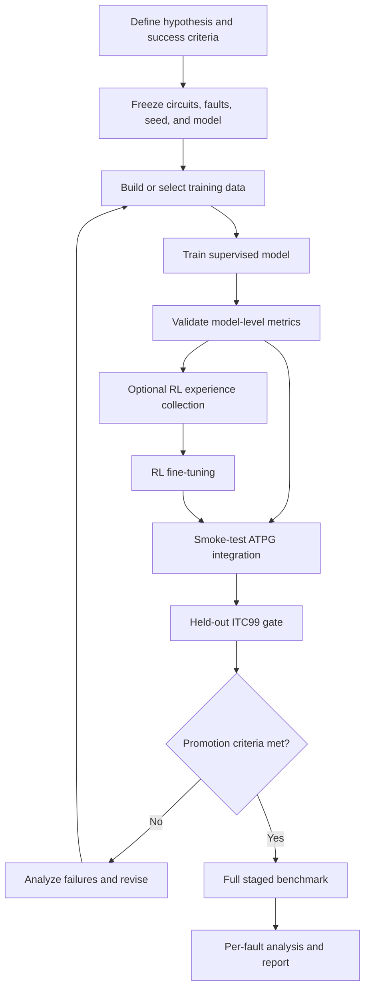
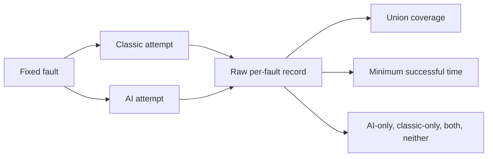

# Experimentation Process

## Purpose

The experimentation process in S-Imply is designed to answer three separate
questions:

1. Can the transformer learn logically consistent assignments on reconvergent
   circuit structures?
2. Does supervised or reinforcement-learning training improve AI-assisted
   PODEM behavior?
3. Does the AI method add coverage, reduce search, or reduce solve time when
   compared with classic ATPG under a controlled budget?

These questions are evaluated in stages. Training metrics are used to diagnose
the model, while held-out ATPG benchmarks are used to judge whether the model is
useful inside the complete solver.

## Experimental workflow



## 1. Define the experiment

Before execution, record the hypothesis and the comparison being made. Examples
include:

- a new checkpoint improves held-out AI-PODEM fault coverage;
- AI guidance reduces backtracks on faults solved by both methods;
- a classic-plus-AI portfolio solves faults that classic PODEM misses under the
  same per-method timeout;
- RL fine-tuning improves reward or ATPG performance relative to the starting
  supervised checkpoint.

The experiment definition should fix:

- benchmark circuits and exact fault pool;
- training, validation, and held-out circuit split;
- random seed and fault-selection method;
- model checkpoint and relevant configuration;
- timeout, backtrack limit, candidate count, and AI attempt count;
- baseline and treatment modes;
- primary success metric and secondary diagnostic metrics;
- output directory and run identifier.

Changing one of these during a run creates a new experiment and should produce a
new manifest or report directory.

## 2. Keep training and final evaluation separate

ISCAS85 and ISCAS89 circuits are used for dataset construction, supervised
training, and RL experience collection. ITC99 is held out from training and
validation so that it can measure transfer to unseen circuits.

The deterministic ITC99 gate is materialized once and reused:

```bash
python -m scripts.select_itc99_gate_faults \
    --bench data/bench/ITC99/b17.bench \
    --output data/bench/ITC99/b17_gate_10pct_faults.json \
    --fraction 0.10 \
    --seed 20260504
```

A small run selected with `--limit-faults` is a pipeline smoke test only. It
checks loading, inference, timeout handling, and report generation; it is not
evidence that a checkpoint passes the full held-out gate.

## 3. Prepare supervised data

`scripts/build_fault_dataset.py` constructs fault-driven SAT and UNSAT samples.
Each sample preserves enough provenance to connect a training example to its
circuit, fault, pattern, and reconvergent path pair.

```bash
python -m scripts.build_fault_dataset \
    --bench_dirs data/bench/ISCAS85 data/bench/iscas89 \
    --output /home/local1/cache-cw/iscas85_89_fault_chunks \
    --max_faults 0 \
    --patterns-per-fault 1 \
    --sim_attempts 50 \
    --unsat-ratio 0.10 \
    --seed 42
```

The generated chunks are converted to tensor shards for resumable, memory-aware
training:

```bash
python -m src.ml.core.dataset preprocess \
    --input /home/local1/cache-cw/iscas85_89_fault_chunks \
    --out /home/local1/cache-cw/iscas85_89_shards \
    --max_len 50 \
    --shard_size 5000 \
    --dtype float16 \
    --resume
```

Before training, verify sample counts, SAT/UNSAT balance, circuit coverage,
maximum path length, and that cached DeepGate embeddings correspond to the
selected circuits.

## 4. Train and validate the supervised model

The supervised trainer is `src/ml/train.py`. A typical experiment specifies the
dataset, output directory, model capacity, optimization settings, and loss
weights explicitly.

```bash
python -m src.ml.train train \
    --processed-dir /home/local1/cache-cw/iscas85_89_shards \
    --output checkpoints/experiment_name \
    --epochs 50 \
    --batch-size 3000 \
    --max-paths 256 \
    --checkpointing \
    --num-workers 4 \
    --amp \
    --lambda-logic 1.0 \
    --lambda-supervised-node 2.0 \
    --lambda-solvability 0.5 \
    --model-dim 512 \
    --ffn-dim 2048 \
    --enc-layers 3 \
    --int-layers 3
```

The best supervised checkpoint is selected by validation loss. Model-level
metrics should still be inspected individually because a lower aggregate loss
can hide a regression in a solver-critical behavior.

Important diagnostics include:

| Metric | Experimental meaning |
|---|---|
| `edge_acc` | Fraction of local gate relationships satisfied |
| `reconv_match_rate` | Agreement at the reconvergence node |
| `solvability_acc` | SAT/UNSAT classification accuracy |
| `constraint_violation_rate` | Violations of supplied logic constraints |
| `anchor_match_rate` | Satisfaction of verified SAT anchors |
| validation loss | Checkpoint-selection signal for supervised training |

Training metrics establish that the model learned the intended task. They do not
replace ATPG evaluation.

## 5. Collect experience and fine-tune with RL

RL experiments start from a named supervised checkpoint. During collection,
AI-PODEM uses the transformer as its behavior policy and records model
snapshots, chosen actions, rewards, and solver outcomes.

```bash
python -m scripts.collect_experience \
    --bench_dirs data/bench/ISCAS85 data/bench/iscas89 \
    --model checkpoints/experiment_name/best_model.pth \
    --max_faults 100 \
    --exploration 5
```

`scripts/train_rl.py` replays the saved experience with REINFORCE:

```bash
python -m scripts.train_rl \
    --model checkpoints/experiment_name/best_model.pth \
    --output checkpoints/experiment_name_rl.pt \
    --epochs 20 \
    --batch_size 256 \
    --max_paths 250 \
    --amp
```

The complete collect, train, and benchmark sequence can be run with
`scripts/run_rl_pipeline.py --all`. For controlled experiments, running the
stages separately is preferable when exact inputs, output directories, or
hardware allocation must be recorded.

RL reports should include training loss, entropy, reward distribution, number
of episodes, success/failure balance, and the exact starting checkpoint. The RL
checkpoint must then be evaluated with the same held-out ATPG procedure as the
supervised checkpoint.

## 6. Validate the solver integration

Before launching a large benchmark:

1. Run unit and regression tests.
2. Run one known small circuit and fault.
3. Run a bounded multi-fault smoke test.
4. Confirm per-fault CSV, JSON summary, and manifest generation.
5. Confirm timeout and backtrack limits are enforced.
6. Confirm each fault starts from reset circuit state.
7. Confirm the intended model and DeepGate package load successfully.

A single-fault trace can be generated with:

```bash
python -m scripts.debug_ai_podem_execution \
    data/bench/ISCAS85/c17.bench \
    "10-1" \
    --model checkpoints/experiment_name/best_model.pth
```

This stage is particularly useful for identifying invalid AI assignments,
unresolved PI constraints, missing reconvergent pairs, and faults that silently
fall onto a different solver path.

## 7. Run the held-out promotion gate

`scripts/benchmark_itc99_gate.py` evaluates a checkpoint on the fixed ITC99
subset and can compare it with classic PODEM:

```bash
python -m scripts.benchmark_itc99_gate \
    --model checkpoints/experiment_name/best_model.pth \
    --fault-list data/bench/ITC99/b17_gate_10pct_faults.json \
    --out docs/session_reports/EXPERIMENT_ID/itc99_gate_report.json \
    --csv-out docs/session_reports/EXPERIMENT_ID/itc99_gate_per_fault.csv \
    --manifest-out docs/session_reports/EXPERIMENT_ID/manifest.json \
    --candidate-count 8 \
    --ai-attempts 2 \
    --max-backtracks 5000 \
    --coverage-target 0.8 \
    --compare-classic
```

The promotion decision should be based on the complete gate, not a smoke-test
subset. Coverage must also be interpreted against the classic-solvable
denominator when that is the configured target.

## 8. Run controlled full benchmarks

Large ATPG comparisons use a fixed JSON fault pool. If multiple ITC99 circuits
are required, first normalize the circuits and build a deterministic balanced
pool:

```bash
python -m scripts.normalize_itc99_benches
python -m scripts.select_itc99_multicircuit_fault_pool
```

Two controlled designs are supported.

### Classic-first hard-fault experiment

1. Run classic PODEM over the complete pool with a fixed timeout.
2. Record every timeout or otherwise selected hard fault.
3. Run AI-PODEM only on that exact subset.
4. Merge the results and report coverage added by AI.

The relevant entry points are:

- `scripts/benchmark_classic_fault_pool.py`;
- `scripts/benchmark_itc99_gate.py`.

This design measures whether AI can recover faults from a clearly defined
classic failure subset.

### Equal-budget tandem experiment

1. Run a classic baseline on the complete pool.
2. Run classic and AI independently with equal per-method budgets.
3. For each fault, retain both raw outcomes.
4. Define portfolio success as either method succeeding.
5. Define portfolio solve time as the minimum successful method time.



`scripts/benchmark_tandem_fault_pool.py` implements this staged comparison and
writes checkpointed CSV, JSON, manifest, and Markdown report artifacts.

## 9. Record evidence at per-fault granularity

Every full experiment should preserve:

- circuit, fault gate, and stuck-at value;
- raw result code for every method;
- success, timeout, untestable, and error classification;
- wall-clock time;
- backtrack count;
- selected winner for portfolio experiments;
- model checkpoint and command-line arguments;
- pool identity, seed, and row count;
- start time, completion state, and software revision.

Aggregate summaries should be regenerated from the per-fault records. Before
accepting a report, check that CSV row counts match the expected pool and that
subset reports match the exact number of selected faults.

## 10. Analyze results

The main ATPG metrics are:

| Metric | Interpretation |
|---|---|
| Fault coverage | Fraction of the fixed pool solved |
| AI-only solves | Direct complementary coverage from AI |
| Classic-only solves | Coverage that still depends on classic search |
| Both solve | Overlapping capability |
| Neither solves | Remaining hard-fault set |
| Mean, median, and P95 time | Typical and tail latency |
| Winner count | Which method is the faster successful path |
| Backtracks | Search effort, reported separately for each method |
| Per-circuit coverage | Detects results dominated by one circuit |

AI value should not be claimed from average time alone. Strong evidence is one
or more of:

- uniquely solved faults under equal budgets;
- reduced portfolio latency on faults solved by both;
- reduced search effort without losing coverage;
- consistent gains across multiple held-out circuits or repeated seeds.

## 11. Reproducibility and long-run operation

Long experiments should run in a named `tmux` session with output written to the
experiment directory. Progress should show completed faults, total faults,
success counts, elapsed time, and ETA.

Large runners should checkpoint frequently enough to recover from interruption
without repeating the complete pool. A resumed run must retain the original
pool, model, limits, and aggregation rules.

Recommended directory layout:

```text
docs/session_reports/EXPERIMENT_ID/
├── manifest.json
├── benchmark.log
├── per_fault.csv
├── summary.json
├── detailed_report.md
└── subsets/
```

Do not overwrite a completed experiment when changing timeouts, fault scope,
checkpoint, or comparison rules. Create a new experiment ID and describe the
relationship between runs in the final report.

## 12. Experiment completion checklist

- [ ] Hypothesis and primary metric are stated.
- [ ] Training and held-out circuits are separated.
- [ ] Fault pool, seed, checkpoint, and limits are frozen.
- [ ] Unit tests and smoke tests pass.
- [ ] Full runs are checkpointed and resumable.
- [ ] Per-fault records contain outcomes, times, and backtracks.
- [ ] Row counts match the expected pool and subsets.
- [ ] Classic and AI attempts use independent reset state.
- [ ] Coverage, overlap, latency, and per-circuit results are reported.
- [ ] Limitations and failed cases are documented.
- [ ] Commands and machine-readable artifacts are preserved.

Following this process keeps model development, solver integration, and ATPG
claims connected by an auditable chain of evidence.
