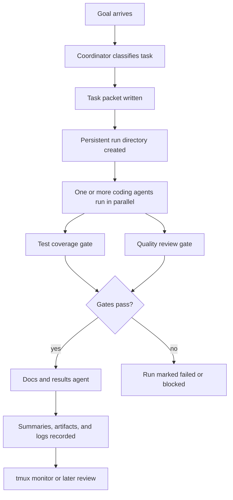

# How I Made My Own Research Group: A Multi Agent Experiment

I'm dealing with a tough ATPG related problem on my own, and I thought, what if I had a team to help? That has become a reality now with modern multi-agent orchestration frameworks. I used langgraph coupled with Codex, Claude and Gemini CLIs to build a customized agent orchestration layer that can reliably take over the heavy lifting for the project, effectively making me a supervisor instead of a worker.

This project is, at heart, about digital circuits, reconvergent paths, and the somewhat stubborn art of back implication. But the more interesting story here is not the domain itself. It is the orchestration layer wrapped around it: a multi-agent workflow that behaves less like a swarm of improvising bots and more like a disciplined studio crew, each person showing up on cue, doing one job, and handing off cleanly before anyone starts freelancing.

The framework was built around a simple idea: if the work is going to be split across specialist roles, then the split should be explicit, traceable, and hard to misread. That is why the orchestration layer is coordinator-first. A planner routes the task, assigns an owner, records validation expectations, and writes the handoff down in a run directory. Nothing magical is hidden in memory, and nothing important is left to vibes. If a result matters, it lives in files, logs, checkpoints, or summaries.

## How It Is Built

The architecture is intentionally lightweight. The coordinator is implemented as plain Python functions and dataclasses, so the logic can be tested directly without depending on a giant framework mood swing. LangGraph can sit on top of it, but it is not the brain. It is more like a stage manager that knows where the props are and when to cue the actors.

Each task becomes a packet. That packet names the owner, the task type, the files in scope, the validation plan, and the artifacts that should exist when the work is done. The task classifier is keyword-driven, which sounds simple because it is simple, and that is the point. The system is meant to route work reliably, not hold philosophical debates about whether a change is more “model” than “benchmark” at 2 a.m.

The runner builds the persistent side of the system. Every run gets its own directory under `runs/orchestration/`, with a state file, an agent prompt, event logs, and any artifacts needed for later review. That gives the workflow a memory that is boring in the best possible way: durable, inspectable, and easy to grep when something misbehaves.

## The Art of Competition

An AI agent on its own is prone to a multitude of issues ranging from goal drift and context window limitation to the worst nightmare of any AI user, hallucination. Also, there's a clear cut difference between what each AI provider excels at. Claude is excellent at general purpose coding, but has a limited context window, lacks domain specific knowledge for ATPG, and Anthropic is extremely stingy with the token budget. OpenAI models are better at niche tasks such as ATPG logic, but again has context and token limitations. Gemini is worse on knowledge and logic, but shines with its massive 1M context window and generous token limits.

The orchestration layer is smart enough to exploit all these nuances. It reads a task, and pits two or more claude agents against each other in a race for excellent code writing. A codex agent runs an MCP server for ATPG analysis and all these are governed by a Gemini agent reviewer that sees all. The orchestration layer lets all these agents communicate effectively, reducing hallucinations and guiding them towards the common goal of high quality problem solving.

## How It Works

The runtime follows a staged flow. First come one or more coding agents, launched in parallel when needed. They receive a narrow goal, a scoped file ownership boundary, and an explicit instruction to stop when they are ready for validation. This is not a “go fix the whole repo” setup. It is a “take this slice, make it correct, and leave breadcrumbs” setup.

Once the coding phase completes, the gates take over. The test coverage gate checks whether the change is actually justified by tests and coverage evidence. The quality review gate looks for repo-rule compliance, regression risk, and unsupported claims. These gates can run in parallel, which is helpful because there is no reason for test feedback and code review to wait politely in the same queue like they are ordering at a coffee shop.

Only after those gates pass does the docs and results agent enter the room. That final agent is not there to invent a story. It is there to write down validated facts, update the documentation, and keep the result trail current. The workflow also forwards sibling summaries into the later stages, so downstream agents can see what their peers discovered instead of repeating the same investigation like a sitcom plot loop.

The monitor layer closes the loop. The runtime can create a tmux session that tails parent and child event streams side by side, which makes the whole process feel less like blind automation and more like a readable control room. You can see the parent status, child progress, and phase transitions without needing to decode the universe from a single log file.

## What The Framework Expects

The expectation is not raw autonomy. It is bounded autonomy with receipts.

Each agent is expected to checkpoint progress, attach artifacts, and mark completion or blockage honestly. If a benchmark or ML job is involved, a run manifest is required before execution. If the work touches theory, the paper draft and project summary are expected to stay in sync. If the result is going to be published into the canonical Notion page, the workflow expects validated claims only, with dated log entries that show commands, artifacts, and next steps.

That sounds strict because it is strict. But the strictness is doing useful work. It keeps the system from drifting into “we think it worked” territory and pushes it toward “here is what ran, here is what changed, and here is the proof.” In practice, that means fewer mystery successes, fewer accidental regressions, and fewer heroic stories that turn out to be unsupported upon contact with reality.

There is also a philosophy hiding in plain sight: the workflow prefers narrow, testable slices over grand, all-at-once interventions. The coordinator assigns responsibility, the runner records history, the gates enforce evidence, and the docs agent translates validated work into human-readable form. Each part is small. Together, they form a machine that can be reasoned about without needing a ceremonial séance.

## The Shape Of The Result

So the project is not just a model, and not just an ATPG system, and not just a benchmark harness. It is a structured collaboration loop around a technical core. The multi-agent framework exists to make that loop legible: route the task, isolate the slice, validate the change, record the evidence, and only then write the story.

That is the real design choice here. Not many agents for the sake of drama, but many agents because different kinds of work need different kinds of scrutiny. If one agent is a carpenter, another is a building inspector, and a third is the person who writes the sign on the front door, the result is usually better than letting one overconfident intern do all three jobs.

The outcome is a workflow that is practical, auditable, and a little bit opinionated. Which, for a project like this, is exactly the point.