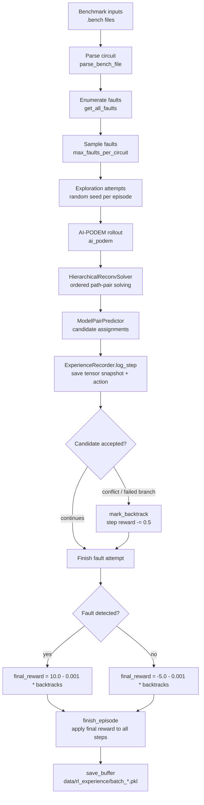
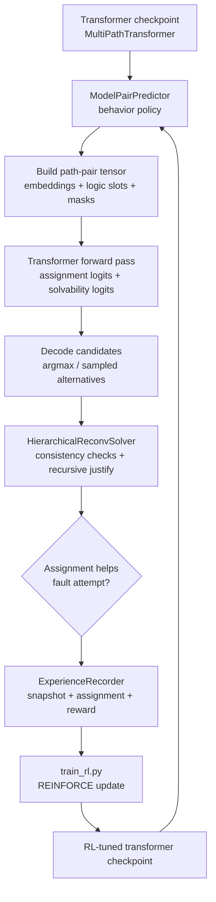
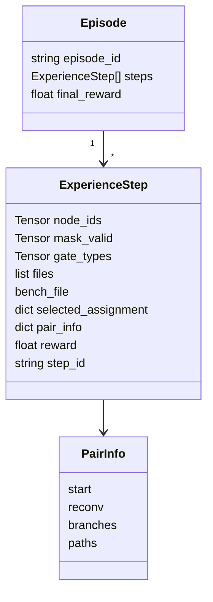
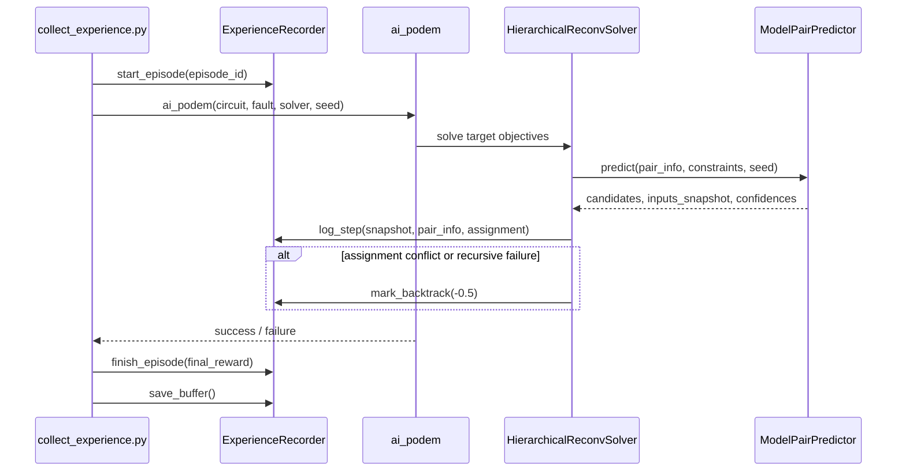
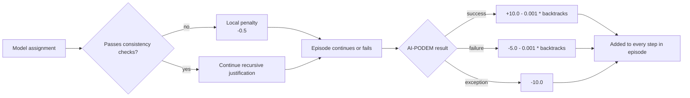
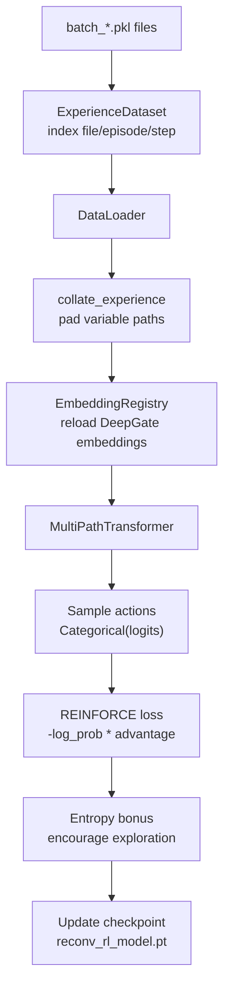
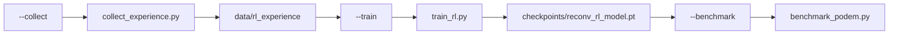

# RL-Based Test Data Generation

This document summarizes how S-Imply generates reinforcement-learning test data
from live AI-PODEM runs. In this flow, "test data" means recorded ATPG
experience: model inputs, selected reconvergent-pair assignments, and rewards
derived from whether the resulting fault attempt succeeds.

## Purpose

The RL data-generation path supplements supervised reconvergent-pair training
with offline experience collected from real ATPG rollouts. Instead of generating
random labels, the collector runs AI-assisted PODEM on benchmark faults and
records the decisions made by the reconvergent-pair solver.

Each recorded sample captures:

- the reconvergent path-pair tensor snapshot used by the model,
- the assignment selected by the predictor,
- metadata for the pair and benchmark,
- delayed reward from the fault-level ATPG result,
- local penalties when a selected assignment causes backtracking.

## High-Level Pipeline



## How RL Interacts With the Transformer

The RL path uses the same `MultiPathTransformer` that is used for supervised
reconvergent-pair prediction and AI-guided PODEM inference. RL does not add a
separate solver or replace PODEM. Instead, it wraps the transformer in an
experience loop:

1. During collection, `ModelPairPredictor` loads a transformer checkpoint and
   uses it as the behavior policy for reconvergent path-pair decisions.
2. For each path pair, the predictor builds the normal transformer inputs:
   DeepGate structural embeddings, logic-state feature slots, gate type IDs,
   node IDs, and a valid-position mask.
3. The transformer returns per-node logits for Boolean assignments, plus
   solvability logits. The predictor decodes those logits into one or more
   candidate assignments.
4. `HierarchicalReconvSolver` tries the decoded assignments inside recursive
   reconvergent-region justification. Only assignments that pass circuit and
   global-consistency checks are allowed to guide PODEM.
5. When a recorder is attached, the solver stores the transformer-facing tensor
   snapshot, the selected assignment, pair metadata, and later reward. This is
   the RL experience sample.
6. Offline RL training reloads those snapshots, reconstructs the transformer
   input batch, runs the `MultiPathTransformer` again, and applies a
   policy-gradient update from the stored rewards.
7. The updated checkpoint can then be used by `ModelPairPredictor` in later
   collection or benchmark runs, closing the collection-training-inference loop.



This means the transformer appears twice in the RL workflow. In collection it
acts as the policy that chooses reconvergent assignments to try. In training it
is the parameterized policy being updated so that high-reward assignment
patterns become more likely and low-reward patterns become less likely.

## Collection Entry Point

Experience collection is implemented in `scripts/collect_experience.py`.

Typical command:

```bash
python -m scripts.collect_experience \
    --bench_dirs data/bench/ISCAS85 data/bench/iscas89 \
    --model checkpoints/unlinked_candidate/best_model.pth \
    --max_faults 50 \
    --exploration 5 \
    --output data/rl_experience
```

The collector performs the following steps:

1. Discovers `.bench` files from directories or explicit file paths.
2. Loads a `MultiPathTransformer` checkpoint once and reuses it across circuits
   when possible. This checkpoint is the policy used to choose reconvergent
   assignments during collection.
3. Parses each benchmark and enumerates structural faults.
4. Randomly shuffles faults and keeps up to `--max_faults` per circuit.
5. Runs `--exploration` attempts per selected fault, using a random seed for
   each episode.
6. Starts an `ExperienceRecorder` episode before each AI-PODEM attempt.
7. Runs `ai_podem()` with AI activation and propagation enabled.
8. Assigns a final episode reward from the fault outcome and PODEM backtrack
   count.
9. Periodically flushes buffered episodes to `batch_*.pkl` files.

## Episode and Step Structure

One episode corresponds to one seeded attempt for one fault:

```text
episode_id = <bench_file>_<fault_gate>_<fault_value>_s<seed>
```

Within the episode, each recorded step corresponds to one reconvergent path-pair
prediction made by `HierarchicalReconvSolver`.



The recorder stores CPU copies of tensor snapshots so later training can reload
the rollout state without retaining GPU graphs or live model objects.

## Where Steps Are Recorded

The solver records data only when the predictor returns an input snapshot. The
snapshot is produced by `ModelPairPredictor` when a recorder is attached.



The snapshot contains:

- `node_ids`: node identifiers for every path position,
- `mask_valid`: valid positions in the padded path tensor,
- `gate_types`: gate type IDs for the same positions,
- `files`: benchmark file metadata used to recover circuit embeddings.

The selected action is stored as `selected_assignment`, a dictionary mapping
gate IDs to predicted Boolean values. The full transformer logits are not saved;
training reruns the transformer on the saved snapshot and uses the reward signal
to update the policy.

## Reward Design

Rewards combine delayed fault-level outcome with local backtracking penalties.



This gives every decision in a successful fault attempt positive credit, while
still penalizing inefficient searches. Failed attempts receive negative reward,
and individual decisions that trigger a solver backtrack get an additional
local penalty.

## Persistence Format

`ExperienceRecorder.save_buffer()` writes batches under the output directory:

```text
data/rl_experience/
  batch_<uuid>.pkl
  batch_<uuid>.pkl
  ...
```

Each pickle file contains:

```python
List[List[ExperienceStep]]
```

That is, a list of episodes, where each episode is a list of step records.
Empty episodes are not saved.

## Training Consumption

`scripts/train_rl.py` loads the generated batches through `ExperienceDataset`.
The dataset lazily indexes all `batch_*.pkl` files as individual experience
steps:



The trainer reconstructs padded transformer inputs from `node_ids`,
`mask_valid`, and `gate_types`. When available, `EmbeddingRegistry` loads
per-benchmark DeepGate embeddings from `.deepgate_cache/<bench>.embed.pt` and
fills the first 128 features of the model input tensor. The remaining feature
slots are left as zeros for compatibility with the current model input
dimension. The reconstructed tensor is fed back into `MultiPathTransformer` to
produce fresh logits for the policy update.

Rewards are normalized within each batch into advantages:

```python
advantages = (rewards - rewards.mean()) / (rewards.std() + 1e-8)
```

The policy-gradient objective samples actions from the transformer distribution,
computes masked log probability over valid path positions, and weights that log
probability by the normalized advantage. Positive-reward samples increase the
probability of similar assignments under the transformer; negative-reward
samples push the policy away from those choices. An entropy term keeps the
policy from collapsing too quickly.

## Full Orchestration

The wrapper `scripts/run_rl_pipeline.py` can run collection, training, and a
small benchmark stage:

```bash
python -m scripts.run_rl_pipeline --all \
    --bench_dirs data/bench/ISCAS85 data/bench/iscas89 \
    --max_faults 100 \
    --exploration 5 \
    --epochs 20
```



On multi-GPU machines, the collection stage distributes benchmark files across
GPUs. It also caps the number of parallel collection processes based on
available RAM, assuming roughly 5 GB per process.

For precise control over collection settings, prefer calling
`scripts.collect_experience` directly. In the current wrapper implementation,
the single-GPU collection path invokes the collector with its default benchmark
directories and exploration count unless those defaults are changed in
`collect_experience.py`.

## Practical Notes

- Collection is intentionally stochastic: each fault can produce multiple
  episodes through different random seeds.
- The model checkpoint used for collection matters because it determines which
  assignments are explored and logged.
- Pair topology is cached by `HierarchicalReconvSolver` and can be persisted via
  `reconv_cache.py`, since reconvergent structure depends on the circuit, not on
  the current fault attempt.
- The collector periodically flushes data every 10 episodes or when RAM usage is
  high, then runs garbage collection and clears CUDA cache when available.
- The recorder caps each episode at 5000 steps to avoid unbounded memory growth
  from pathological backtracking.
