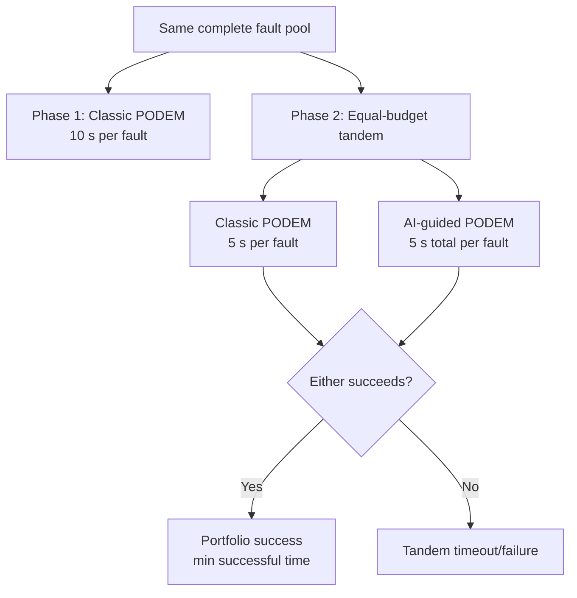

# Equal-Budget Classic and AI Tandem ATPG Benchmark

## Executive summary

This benchmark evaluates **10,000 identical faults** in two controlled phases. The baseline gives classic PODEM 10 seconds per fault. The tandem phase gives classic and AI-guided PODEM 5 seconds each, records both outcomes, and uses the faster successful method as portfolio solve time.

The equal-budget tandem solved **9,669/10,000 (96.69%)**. AI uniquely solved **0** faults that classic did not solve in its equal 5-second budget, adding **0.00% absolute coverage**. On faults solved by both, AI was the faster successful path for **415** faults.

## Experimental design

The two tandem methods run as independent attempts on reset circuit state. Both are always measured; a success by one method does not suppress the other measurement. AI's five-second cap includes topology lookup, model inference, direct-pattern simulation, and any AI-guided PODEM search.

## Coverage comparison

| Configuration | Solved | Failed | Coverage |
|---|---:|---:|---:|
| Classic baseline (10 s) | 1,933 | 8,067 | 19.33% |
| Classic equal-budget (5 s) | 9,669 | 331 | 96.69% |
| AI equal-budget (5 s) | 9,527 | 473 | 95.27% |
| Tandem union | 9,669 | 331 | 96.69% |

## Per-circuit coverage

Every locally available standard ITC99 circuit contributes faults to the pool. This table prevents a large circuit from hiding weak or missing circuit coverage.

| Circuit | Pool faults | Classic 10 s | Classic 5 s | AI 5 s | Tandem | AI only |
|---|---:|---:|---:|---:|---:|---:|
| b01 | 94 | 68 | 94 | 94 | 94 (100.00%) | 0 |
| b02 | 54 | 42 | 54 | 54 | 54 (100.00%) | 0 |
| b03 | 312 | 114 | 312 | 312 | 312 (100.00%) | 0 |
| b04 | 596 | 216 | 593 | 588 | 593 (99.50%) | 0 |
| b05 | 596 | 81 | 569 | 539 | 569 (95.47%) | 0 |
| b06 | 100 | 82 | 100 | 100 | 100 (100.00%) | 0 |
| b07 | 596 | 138 | 596 | 580 | 596 (100.00%) | 0 |
| b08 | 358 | 114 | 358 | 350 | 358 (100.00%) | 0 |
| b09 | 338 | 180 | 338 | 338 | 338 (100.00%) | 0 |
| b10 | 400 | 124 | 400 | 399 | 400 (100.00%) | 0 |
| b11 | 596 | 147 | 587 | 570 | 587 (98.49%) | 0 |
| b12 | 596 | 92 | 596 | 594 | 596 (100.00%) | 0 |
| b13 | 596 | 280 | 593 | 593 | 593 (99.50%) | 0 |
| b14 | 596 | 17 | 594 | 587 | 594 (99.66%) | 0 |
| b15_1 | 596 | 59 | 593 | 581 | 593 (99.50%) | 0 |
| b17 | 596 | 43 | 573 | 555 | 573 (96.14%) | 0 |
| b18 | 596 | 31 | 531 | 524 | 531 (89.09%) | 0 |
| b19 | 596 | 40 | 411 | 406 | 411 (68.96%) | 0 |
| b20 | 596 | 24 | 591 | 586 | 591 (99.16%) | 0 |
| b21 | 596 | 26 | 593 | 590 | 593 (99.50%) | 0 |
| b22 | 596 | 15 | 593 | 587 | 593 (99.50%) | 0 |

| Equal-budget overlap | Faults | Meaning |
|---|---:|---|
| Both solve | 9,527 | Redundant coverage; latency competition |
| AI only | 0 | Direct complementary contribution from AI |
| Classic only | 142 | Classic remains essential |
| Neither | 331 | Tandem timeout/failure |

## Timing and winner analysis

| Metric | Classic 5 s | AI 5 s | Tandem chosen solve time |
|---|---:|---:|---:|
| Mean (s) | 0.364 | 0.433 | 0.221 |
| Median (s) | 0.006 | 0.025 | 0.005 |
| P95 (s) | 2.476 | 3.095 | 1.145 |

AI supplied the minimum successful solve time on **415** faults; classic won on **9,250**, with **4** ties.

## Backtracking

| Measurement | Total | Interpretation |
|---|---:|---|
| Classic 10 s backtracks | 5,912,802 | Baseline search work |
| Classic 5 s backtracks | 15,800 | Equal-budget classic work |
| AI-guided search backtracks | 519 | PODEM search after AI inference; direct AI successes use zero |

The AI counter is deliberately labeled *AI-guided search backtracks*: model inference is not a backtracking procedure, so treating it as an ordinary PODEM backtrack count would overstate comparability.

## Relation to the 10-second classic baseline

| Cross-budget category | Faults |
|---|---:|
| Tandem union also solved by classic 10 s | 1,931 |
| Tandem union solved, classic 10 s did not | 7,738 |
| Classic 10 s solved, tandem union did not | 2 |
| Failed in all measured configurations | 329 |

## Why AI is a valid contribution

1. **Controlled marginal coverage.** AI-only solves use the same faults and the same per-method timeout as classic, so they directly measure complementary capability.
2. **Portfolio latency.** Taking the minimum successful time is operationally valid when both solvers can be dispatched together; AI wins reduce response latency even when classic would eventually solve the same fault.
3. **Different search bias.** Classic uses deterministic structural heuristics, while AI supplies learned reconvergence-aware assignments. Unique solves demonstrate that the learned bias reaches useful regions classic misses under the same time cap.
4. **Failure containment.** The portfolio never loses a classic success merely because AI fails: independent state and union semantics preserve either result.
5. **Auditable evidence.** Per-fault raw result codes, wall times, backtracks, winner, and checkpoint data support reproduction and alternative aggregation.

## Limitations and interpretation

- This establishes contribution on this fixed fault pool and checkpoint; it does not by itself prove generalization to unrelated circuits.
- Sequential wall-clock execution emulates two independent equal-budget workers. The reported portfolio latency is the minimum method time; actual parallel deployment also incurs scheduler and hardware contention overhead.
- `tandem_timeout` means neither method produced a test within its budget. Raw result codes remain available to distinguish algorithmic timeout, backtrack limit, and untestable/error outcomes.
- OS scheduling and accelerator state introduce timing noise. Repeated trials are appropriate before making small latency-difference claims.

## Reproduction artifacts

- Fault pool: `data/bench/ITC99_all_numeric/fault_pool_10000_seed20260713.json`
- Model: `checkpoints/reconv_solver_fix_20260511/best_model.pth`
- Baseline CSV: `docs/session_reports/20260713_itc99_all_tandem/classic10_per_fault.csv`
- Tandem CSV: `docs/session_reports/20260713_itc99_all_tandem/classic5_ai5_tandem_per_fault.csv`
- Machine-readable summary: `docs/session_reports/20260713_itc99_all_tandem/summary.json`
