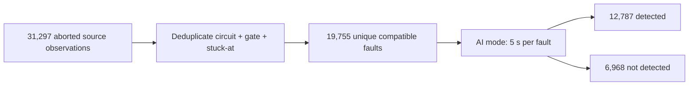

# Atalanta HDF Abort Pool: Benchmark Breakdown and AI-Mode Coverage

## Scope and source of truth

This report breaks down the **Atalanta hard-to-detect-fault (HDF) abort pool** by benchmark and reports the measured coverage of AI-guided PODEM (`AI mode`) on that pool.

The calculations use:

- `fault_pool.json` for pool construction, source-observation, and deduplication data.
- `ai_per_fault.csv` for final per-fault AI outcomes.
- Run configuration from `summary.json`: model `checkpoints/reconv_solver_fix_20260511/best_model.pth`, CUDA device, **5.0 s total AI budget per fault**, and **100,000 maximum AI backtracks**.

The per-fault CSV is the outcome source of truth because it contains all **19,755** pool faults. Its final result is **12,787 detected faults (64.73% coverage)**. The later hand-edited `comp_report.md` states 13,573 detections, but that number is not reproducible from the retained CSV and is therefore not used here.

## Executive summary

| Metric | Result |
|---|---:|
| Aborted source observations included | 31,297 |
| Duplicate observations removed | 11,542 |
| Unique faults in AI evaluation pool | 19,755 |
| Benchmarks represented | 12 |
| AI detected | 12,787 |
| AI not detected within the run budget | 6,968 |
| **AI-mode coverage** | **64.73%** |
| Faults with reconvergent path pairs | 9,887 (50.05%) |
| Direct AI precheck detections | 157 (0.79%) |
| Total measured AI runtime | 53,366.55 s (14.82 h) |
| Mean measured AI runtime per fault | 2.701 s |

`b19` dominates the pool: it contains **14,630 faults (74.06%)** and contributes **6,101 of the 6,968 AI misses (87.56%)**. AI coverage is **58.30%** on `b19`; across all other benchmarks combined it is **83.08%** (4,258/5,125).

## Abort-pool composition by benchmark

The source-observation count includes repeated Atalanta measurements of the same fault. A unique pool fault is keyed by benchmark, gate, and stuck-at value. `Pool share` is based on the 19,755 unique faults evaluated by AI mode.

| Benchmark | Aborted source observations | Unique pool faults | Duplicates removed | Pool share | SA0 faults | SA1 faults |
|---|---:|---:|---:|---:|---:|---:|
| b14 | 43 | 43 | 0 | 0.22% | 30 | 13 |
| b15 | 649 | 649 | 0 | 3.29% | 335 | 314 |
| b17 | 1,718 | 1,718 | 0 | 8.70% | 906 | 812 |
| b18 | 1,776 | 1,776 | 0 | 8.99% | 926 | 850 |
| b19 | 25,987 | 14,630 | 11,357 | 74.06% | 7,242 | 7,388 |
| b20 | 218 | 218 | 0 | 1.10% | 98 | 120 |
| b21 | 120 | 120 | 0 | 0.61% | 49 | 71 |
| b22 | 312 | 312 | 0 | 1.58% | 138 | 174 |
| c432 | 4 | 3 | 1 | 0.02% | 0 | 3 |
| c6288 | 468 | 284 | 184 | 1.44% | 200 | 84 |
| s13207 | 1 | 1 | 0 | <0.01% | 0 | 1 |
| s38584 | 1 | 1 | 0 | <0.01% | 0 | 1 |
| **Total** | **31,297** | **19,755** | **11,542** | **100.00%** | **9,924** | **9,831** |

Only `b19`, `c6288`, and `c432` have repeated observations in the retained pool inputs. The largest effect is on `b19`, where deduplication collapses 25,987 abort observations to 14,630 unique faults.

## AI-mode coverage by benchmark

Coverage is `AI detected / unique pool faults`. These are conditional HDF-pool coverage values, not full-circuit stuck-at coverage values.

| Benchmark | Pool faults attempted | AI detected | AI not detected | AI-mode coverage | Share of all AI detections | Share of all AI misses |
|---|---:|---:|---:|---:|---:|---:|
| b14 | 43 | 42 | 1 | 97.67% | 0.33% | 0.01% |
| b15 | 649 | 632 | 17 | 97.38% | 4.94% | 0.24% |
| b17 | 1,718 | 1,607 | 111 | 93.54% | 12.57% | 1.59% |
| b18 | 1,776 | 1,310 | 466 | 73.76% | 10.24% | 6.69% |
| b19 | 14,630 | 8,529 | 6,101 | 58.30% | 66.70% | 87.56% |
| b20 | 218 | 214 | 4 | 98.17% | 1.67% | 0.06% |
| b21 | 120 | 120 | 0 | 100.00% | 0.94% | 0.00% |
| b22 | 312 | 303 | 9 | 97.12% | 2.37% | 0.13% |
| c432 | 3 | 0 | 3 | 0.00% | 0.00% | 0.04% |
| c6288 | 284 | 28 | 256 | 9.86% | 0.22% | 3.67% |
| s13207 | 1 | 1 | 0 | 100.00% | 0.01% | 0.00% |
| s38584 | 1 | 1 | 0 | 100.00% | 0.01% | 0.00% |
| **Total** | **19,755** | **12,787** | **6,968** | **64.73%** | **100.00%** | **100.00%** |

### Coverage ranking

| Rank | Benchmark | AI-mode coverage | Detected / attempted | Interpretation |
|---:|---|---:|---:|---|
| 1 | b21 | 100.00% | 120 / 120 | Complete coverage on a meaningful pool subset |
| 1 | s13207 | 100.00% | 1 / 1 | Complete, but only one pooled fault |
| 1 | s38584 | 100.00% | 1 / 1 | Complete, but only one pooled fault |
| 4 | b20 | 98.17% | 214 / 218 | Four misses |
| 5 | b14 | 97.67% | 42 / 43 | One miss |
| 6 | b15 | 97.38% | 632 / 649 | Strong coverage over 649 faults |
| 7 | b22 | 97.12% | 303 / 312 | Nine misses |
| 8 | b17 | 93.54% | 1,607 / 1,718 | Strong coverage over a large subset |
| 9 | b18 | 73.76% | 1,310 / 1,776 | Moderate coverage; 466 misses |
| 10 | b19 | 58.30% | 8,529 / 14,630 | Dominates aggregate coverage and misses |
| 11 | c6288 | 9.86% | 28 / 284 | Low coverage on multiplier faults |
| 12 | c432 | 0.00% | 0 / 3 | Very small sample; no detections |

## AI execution details by benchmark

`Reconvergent-pair faults` indicates faults for which the AI path found reconvergent path-pair features. `Direct precheck` indicates detection before the main AI-guided PODEM search. `Zero-BT detections` counts successful AI outcomes with zero recorded search backtracks.

| Benchmark | Reconvergent-pair faults | Pair rate | Direct precheck detections | Zero-BT detections | AI BT on detections | Mean time/fault (s) |
|---|---:|---:|---:|---:|---:|---:|
| b14 | 43 | 100.00% | 0 | 42 | 0 | 0.232 |
| b15 | 558 | 85.98% | 35 | 629 | 4 | 0.245 |
| b17 | 1,374 | 79.98% | 22 | 1,605 | 27 | 0.745 |
| b18 | 1,253 | 70.55% | 36 | 1,307 | 9 | 2.584 |
| b19 | 5,762 | 39.38% | 62 | 8,529 | 0 | 3.113 |
| b20 | 207 | 94.95% | 0 | 213 | 1 | 0.441 |
| b21 | 112 | 93.33% | 1 | 120 | 0 | 0.455 |
| b22 | 291 | 93.27% | 1 | 303 | 0 | 0.799 |
| c432 | 3 | 100.00% | 0 | 0 | 0 | 3.660 |
| c6288 | 284 | 100.00% | 0 | 28 | 0 | 4.848 |
| s13207 | 0 | 0.00% | 0 | 1 | 0 | 0.018 |
| s38584 | 0 | 0.00% | 0 | 1 | 0 | 0.070 |
| **Total** | **9,887** | **50.05%** | **157** | **12,778** | **41** | **2.701** |

Of the 12,787 detections, **12,778 (99.93%)** used zero recorded AI search backtracks. Nine detections used one or more backtracks, for a combined total of 41. This counter measures the AI-guided PODEM implementation's search backtracks; it should not be treated as identical in cost to one Atalanta backtrack.

## Outcome and failure profile

| AI result | Count | Share of pool |
|---|---:|---:|
| Result code 1: detected | 12,787 | 64.73% |
| Result code 2: 5 s total budget exceeded | 6,966 | 35.26% |
| Result code 3: non-detected outcome without timeout text | 2 | 0.01% |
| **Total** | **19,755** | **100.00%** |

The two result-code-3 outcomes are both in `c432`. The remaining `c432` fault and every other miss carry the explicit message `AI mode exceeded its 5.000s total budget`.

## Atalanta effort on faults recovered by AI

The representative Atalanta count is the maximum abort-backtrack observation retained for each deduplicated fault. On the 12,787 faults recovered by AI, Atalanta's representative observations sum to **1,287,452,787 backtracks**, versus **41 recorded AI search backtracks** on those successful AI executions.

| Benchmark | AI detections | Representative Atalanta BT on detections | AI search BT on detections |
|---|---:|---:|---:|
| b14 | 42 | 4,200,042 | 0 |
| b15 | 632 | 63,200,632 | 4 |
| b17 | 1,607 | 160,701,607 | 27 |
| b18 | 1,310 | 131,001,310 | 9 |
| b19 | 8,529 | 862,908,529 | 0 |
| b20 | 214 | 21,400,214 | 1 |
| b21 | 120 | 12,000,120 | 0 |
| b22 | 303 | 30,300,303 | 0 |
| c432 | 0 | 0 | 0 |
| c6288 | 28 | 1,540,028 | 0 |
| s13207 | 1 | 100,001 | 0 |
| s38584 | 1 | 100,001 | 0 |
| **Total** | **12,787** | **1,287,452,787** | **41** |

This comparison is conditional on AI success and shows search-effort counters, not equivalent wall-clock work. Atalanta's value proves that the source run reached its configured abort bound; it does not imply that Atalanta and AI perform equal work per counted backtrack.

## Key findings

1. **Overall AI-mode coverage is 64.73%** on the deduplicated Atalanta-aborted pool.
2. The aggregate is highly sensitive to `b19`, which holds nearly three quarters of the pool. Removing `b19` raises the remaining-pool coverage to **83.08%**.
3. AI mode exceeds 93% coverage on `b14`, `b15`, `b17`, `b20`, `b21`, and `b22`.
4. `c6288` is the clearest low-coverage benchmark with a nontrivial sample: **9.86%** across 284 faults.
5. Pool deduplication matters primarily for `b19`: 11,357 of all 11,542 removed duplicate observations come from that benchmark.
6. Nearly all successful executions record zero AI search backtracks, but many still consume nonzero structural inference and simulation time; zero backtracks must not be described as zero computation.

## Reproducibility notes

- Fault identity: `(benchmark, gate_id, stuck_at)`.
- Pool definition: a compatible local BENCH fault marked `aborted` by Atalanta in at least one source HDF CSV.
- Repeated observations: retained in `fault_pool.json` under `atalanta_sources`, but counted once in coverage.
- AI coverage denominator: all unique faults for that benchmark in the 19,755-fault pool.
- AI timeout: 5.0 seconds total per fault.
- AI backtrack ceiling: 100,000.
- Percentages are calculated from integer counts and rounded to two decimal places.
