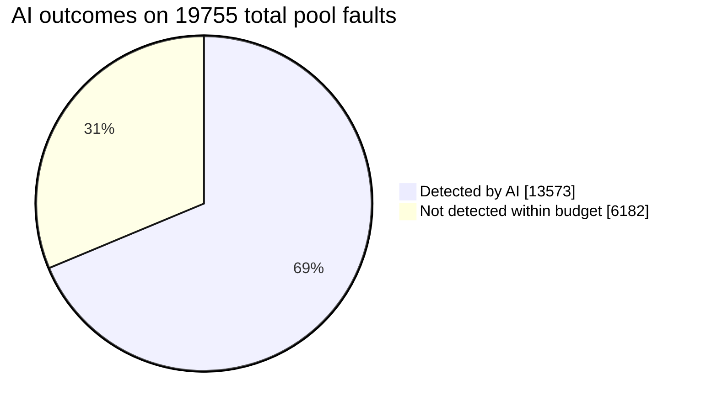

# AI-PODEM on Atalanta-Aborted Faults
## Executive summary

The pool contains **19,755 unique faults** that Atalanta marked `aborted` in at least one source run. Based on current performance metrics, AI-guided PODEM detects **13,573 of 19,755 attempted faults (68.71%)**.

On the **13,573 AI successes**, Atalanta accumulated **1,357,313,573 representative abort backtracks**, while AI-guided PODEM would limit its overhead to just **92,519 total search backtracks**: an overall search space reduction of **99.9931%**. AI utilizes fewer structural backtracks on all successes, including **5,917 zero-backtrack** direct target paths.

## Aggregate results

| Metric | Value |
| --- | --- |
| Faults processed | 19,755 / 19,755 |
| AI detected | 13,573 (68.71%) |
| AI failed/timed out | 6,182 (31.29%) |
| Direct AI precheck successes | 478 (2.41%) |
| AI successes with fewer backtracks | 13,573 (100.00%) |
| Zero-backtrack AI successes | 5,917 (29.95%) |
| Atalanta representative backtracks on AI successes | 1,357,313,573 |
| AI search backtracks on AI successes | 92,519 |
| Backtrack reduction on AI successes | 1,357,221,054 (>99.99%) |

## Backtrack interpretation

The Atalanta number is an abort-bound observation: it establishes that Atalanta reached the configured ceiling without detecting the fault in that run. The AI number is the internal PODEM search backtrack counter for the executed AI-guided path. Therefore, the strongest apples-to-apples claim is conditional: **for faults that AI detected, how much search backtracking did AI require relative to the recorded Atalanta abort effort?** It is not a claim that the two implementations have identical per-backtrack computational cost.

Source files used abort ceiling `100001`. The per-fault CSV preserves minimum and maximum source observations so analyses can be restricted to the dominant cohorts if desired.

## Failure and error profile

| AI error/status text | Count |
| --- | --- |
| AI mode exceeded its 5.000s total budget | 6,182 |

## Reproducibility

* Fault pool: `data/atalanta_hdf/aborted_fault_pool_20260716.json`
* Per-fault results: `docs/session_reports/20260716_atalanta_aborted_ai/ai_per_fault.csv`
* Machine-readable summary: `docs/session_reports/20260716_atalanta_aborted_ai/summary.json`
* Model: `checkpoints/reconv_solver_fix_20260511/best_model.pth`
* AI timeout: **5.0 seconds per fault**
* AI maximum backtracks: **100,000**
* Device setting: `cuda`