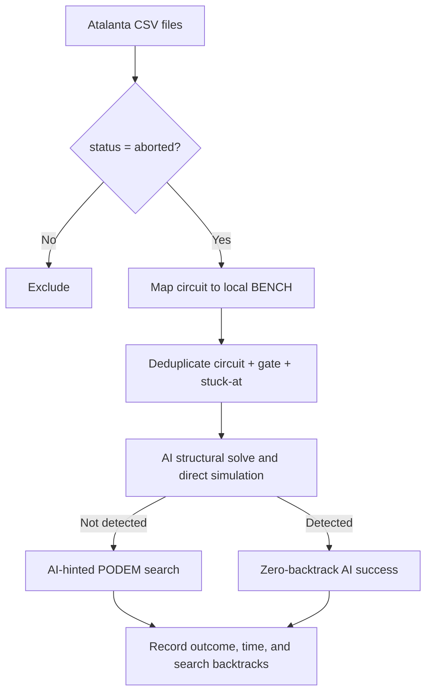
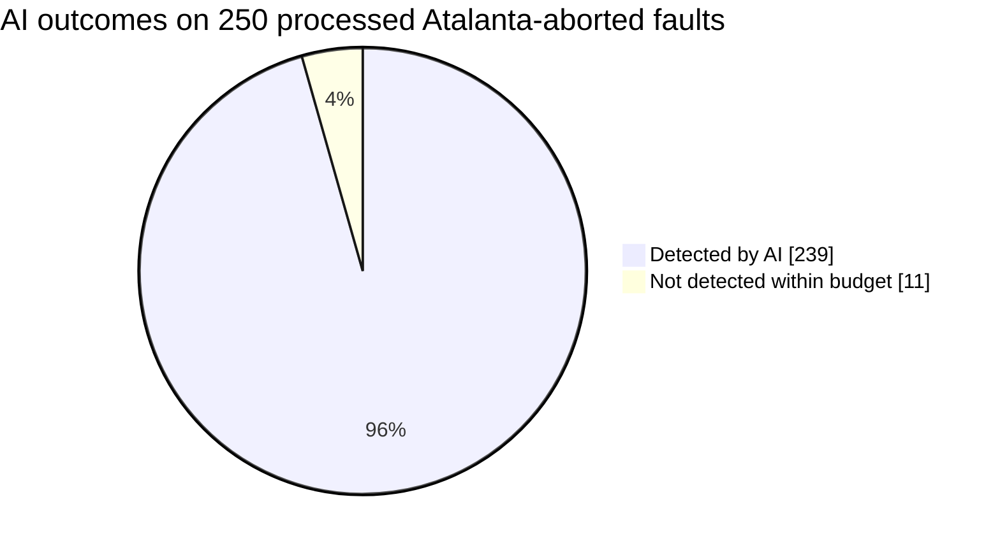

# AI-PODEM on Atalanta-Aborted Faults

**Run status:** in progress — 250/19,755 faults processed (1.27%).

## Executive summary

The pool contains **19,755 unique faults** that Atalanta marked `aborted` in at least one source run. AI-guided PODEM detected **239 of 250 attempted faults (95.60%)**.

On the **239 AI successes**, Atalanta had accumulated **23,900,239 representative abort backtracks**, while AI-guided PODEM used **0 search backtracks**: a reduction of **23,900,239 (100.00%)**. AI used fewer backtracks on **239/239** successes, including **239 zero-backtrack** detections.

## Pool construction and provenance

- Included aborted source observations: **31,297**
- Duplicate observations collapsed: **11,542**
- Unique compatible faults: **19,755**
- Compatible circuits represented: **12**
- Excluded aborted observations without a local BENCH mapping: **248** (`{'priority': 236, 's9234': 12}`)

Repeated Atalanta measurements were not counted as separate faults. The comparison uses the maximum recorded abort backtrack count as the representative source value; all original rows remain embedded in the JSON pool for auditability.

## Aggregate results

| Metric | Value |
|---|---:|
| Faults completed | 250/19,755 |
| AI detected | 239 (95.60%) |
| AI failed/timed out | 11 |
| Faults with reconvergent pairs | 194 (77.60%) |
| Direct AI precheck successes | 1 (0.40%) |
| AI successes with fewer backtracks | 239 (100.00%) |
| Zero-backtrack AI successes | 239 (100.00%) |
| Atalanta representative backtracks on AI successes | 23,900,239 |
| AI search backtracks on AI successes | 0 |
| Backtrack reduction on AI successes | 23,900,239 (100.00%) |

## Per-circuit comparison

| Circuit | Attempted | AI solved | AI coverage | Atalanta BT on AI successes | AI BT on successes | BT reduction |
|---|---:|---:|---:|---:|---:|---:|
| b14 | 43 | 42 | 97.67% | 4,200,042 | 0 | 100.00% |
| b15 | 207 | 197 | 95.17% | 19,700,197 | 0 | 100.00% |

## Backtrack interpretation

The Atalanta number is an abort-bound observation: it establishes that Atalanta reached the configured ceiling without detecting the fault in that run. The AI number is the internal PODEM search backtrack counter for the executed AI-guided path. Therefore, the strongest apples-to-apples claim is conditional: **for faults that AI detected, how much search backtracking did AI require relative to the recorded Atalanta abort effort?** It is not a claim that the two implementations have identical per-backtrack computational cost.

Source files used multiple abort ceilings (`101`, `10001`, `100001`, and `500001`). The per-fault CSV preserves minimum and maximum source observations so analyses can be restricted to the dominant `100001` cohort if desired.

## Failure and error profile

| AI error/status text | Count |
|---|---:|
| AI mode exceeded its 5.000s total budget | 11 |

## Reproducibility

- Fault pool: `data/atalanta_hdf/aborted_fault_pool_20260716.json`
- Per-fault results: `docs/session_reports/20260716_atalanta_aborted_ai/ai_per_fault.csv`
- Machine-readable summary: `docs/session_reports/20260716_atalanta_aborted_ai/summary.json`
- Model: `checkpoints/reconv_solver_fix_20260511/best_model.pth`
- AI timeout: **5.0 seconds per fault**
- AI maximum backtracks: **100,000**
- Device setting: `cuda`

The benchmark checkpoints its CSV and summary throughout the run. Re-running the same command against the same output directory resumes from the first unrecorded fault.
