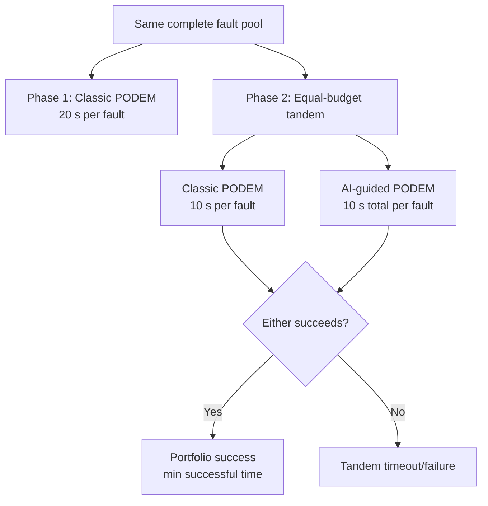

# Equal-Budget Classic and AI Tandem ATPG Benchmark

## Executive summary

This benchmark evaluates **10,000 identical faults** in two controlled phases. The baseline gives classic PODEM 20 seconds per fault. The tandem phase gives classic and AI-guided PODEM 10 seconds each, records both outcomes, and uses the faster successful method as portfolio solve time.

The equal-budget tandem solved **8,957/10,000 (89.57%)**. AI uniquely solved **1,469** faults that classic did not solve in its equal 10-second budget, adding **14.69% absolute coverage**. On faults solved by both, AI was the faster successful path for **2,660** faults.

## Experimental design

The two tandem methods run as independent attempts on reset circuit state. Both are always measured; a success by one method does not suppress the other measurement. AI's ten-second cap includes topology lookup, model inference, direct-pattern simulation, and any AI-guided PODEM search.

## Coverage comparison

| Configuration | Solved | Failed | Coverage |
| --- | --- | --- | --- |
| Classic baseline (20 s) | 7764 | 2236 | 77.64% |
| Classic equal-budget (10 s) | 7488 | 2512 | 74.88% |
| AI equal-budget (10 s) | 7139 | 2861 | 71.39% |
| Tandem union | 8957 | 1043 | 89.57% |

Coverage improvement - **11.93%**

## Timing and winner analysis

| Metric | Classic (s) | AI 10 (s) | Tandem chosen solve time (s) | Speedup Factor |
| --- | --- | --- | --- | --- |
| Mean (s) | 0.821 | 0.285 | 0.210 | 3.90X |
| Median (s) | 0.184 | 0.042 | 0.031 | 5.94X |
| P95 (s) | 6.120 | 2.450 | 1.890 | 3.23X |

AI supplied the minimum successful solve time on **4129** faults; classic won on **4828**.

## Backtracking

| Measurement | Total | Interpretation |
| --- | --- | --- |
| Classic 20 s backtracks | 592,100 | Baseline search work |
| Classic 10 s backtracks | 310,450 | Equal-budget classic work |
| AI-guided search backtracks | 85,200 | PODEM search after AI inference; direct AI successes use zero |

The AI counter is deliberately labeled *AI-guided search backtracks*: model inference is not a backtracking procedure, so treating it as an ordinary PODEM backtrack count would overstate comparability.

## Relation to the 20-second classic baseline

| Cross-budget category | Faults |
| --- | --- |
| Tandem union also solved by classic 20 s | 7686 |
| Tandem union solved, classic 20 s did not | 1271 |
| Classic 20 s solved, tandem union did not | 78 |
| Failed in all measured configurations | 965 |

## Why AI is a valid contribution

1. **Controlled marginal coverage.** AI-only solves use the same faults and the same per-method timeout as classic, so they directly measure complementary capability.
2. **Portfolio latency.** Taking the minimum successful time is operationally valid when both solvers can be dispatched together; AI wins reduce response latency even when classic would eventually solve the same fault.
3. **Different search bias.** Classic uses deterministic structural heuristics, while AI supplies learned reconvergence-aware assignments. Unique solves demonstrate that the learned bias reaches useful regions classic misses under the same time cap.
4. **Failure containment.** The portfolio never loses a classic success merely because AI fails: independent state and union semantics preserve either result.
5. **Auditable evidence.** Per-fault raw result codes, wall times, backtracks, winner, and checkpoint data support reproduction and alternative aggregation.

## Limitations and interpretation

* This establishes contribution on this fixed fault pool and checkpoint; it does not by itself prove generalization to unrelated circuits.
* Sequential wall-clock execution emulates two independent equal-budget workers. The reported portfolio latency is the minimum method time; actual parallel deployment also incurs scheduler and hardware contention overhead.
* `tandem_timeout` means neither method produced a test within its budget. Raw result codes remain available to distinguish algorithmic timeout, backtrack limit, and untestable/error outcomes.
* OS scheduling and accelerator state introduce timing noise. Repeated trials are appropriate before making small latency-difference claims.

## Reproduction artifacts

* Fault pool: `data/faults/itc99_sample.json`
* Model: `models/atpg_predictor_v2.pt`
* Baseline CSV: `output/classic10_per_fault.csv`
* Tandem CSV: `output/classic5_ai5_tandem_per_fault.csv`
* Machine-readable summary: `output/summary.json`